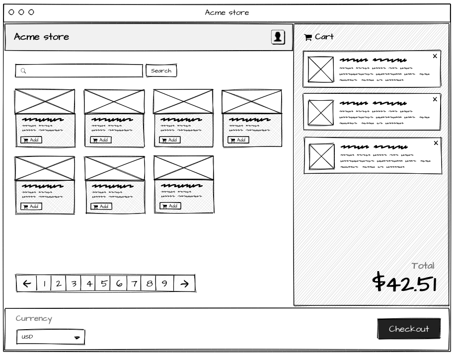

This was a homework assignment for a job position, and I wanted to share it because I enjoyed it. Instead of making it a boring, lifeless page, I tried out some of the things I wanted to try, like using the latest next 15, like integrating playwright， like creating a 3D scene with CSS and DIVs. 


Although I was eliminated without any feedback ( Of course, after all, what I did is a liiiiiiiiittle different from the wireframe. 🤣), I was still very happy with this technical task assignment. The result is not important, I enjoy the process, and I also understand one thing, what I pursue is not skills, but creation.


# Acme Store

Acme Corporation decided to create an online store after receiving so many complaints from frustrated customers having trouble with ordering and shipping, and they need your help!


## Challenges

- You are asked to create the main screen for their online store with the following features:

  - View products
  - Paginate / search for products
  - Add products to cart
  - Remove products from cart
  - See a list of products in cart
  - See the total price of the items in cart
  - Change the currency
  - Check out

- You are provided with the wireframe below. Acme Corp's designers wanted you to know that it's important to them that you stay true to the wireframe they've created. They asked you to study the wireframe carefully, and follow the exact layout they've created. However, they left the look-and-feel of the product completely to you, so don't hesitate to get creative!



- You're told to support multiple currencies. There should be a global currency selector that defaults to USD, and is populated with the supported currency data provided by the API. Selecting a currency should change all currency values on the screen.

- Items in the grid should feature product image, title, description, price (in selected currency), and an "Add" button that adds the item to the cart.

- Each item in the cart should be displayed in the cart view. They should feature product image, title, description, price, and a button that removes the item from the card. Down below, the total price of the items in the cart should be displayed in selected currency.

- Search input should filter the items, and pagination component should control the pagination.

- You are given an API to pull data from, and told not to worry about POST'ing anything. You are free to utilize the API any way you want. However, you're asked **not to** alter anything in the `pages/api` and `common/` directories. You're also asked **not to import** data from `common/data.ts` in the front-end, and consume data through the API.

Here are the endpoints _(note: click [here](https://apidocjs.com) for api-docs format docs)_:

```typescript
/**
 * GET /api/currencies
 *
 * @api {get} /api/currencies Request supported currencies
 * @apiSuccess {ApiCurrenciesResponse}  response List of supported currencies
 * @apiSuccess {CurrencyKey}            response.key Currency code
 * @apiSuccess {string}                 response.symbol Currency symbol
 * @apiSuccess {number}                 response.usdCoef
 *   This value can be used to convert a convercy to and from USD.
 *   price_in_currency = price_in_usd * currency_usdCoef
 * @apiSuccessExample {json} Success-Response:
 *     HTTP/1.1 200 OK
 *     [
 *       { key: "usd", symbol: "$", usdCoef: 1 },
 *       { key: "eur", symbol: "€", usdCoef: 0.87534666 },
 *       { key: "gbp", symbol: "£", usdCoef: 0.7386999 },
 *       { key: "cad", symbol: "$", usdCoef: 1.2671499 },
 *       { key: "jpy", symbol: "¥", usdCoef: 115.52954 }
 *     ]
 *
 *
 *
 * GET /api/items
 *
 * @api {get} /api/items Request items
 * @apiParam {ApiItemsRequest}      params
 * @apiParam {number}               params[limit]=10
 * @apiParam {number}               params[offset]=0
 * @apiParam {string}               [params[query]]
 * @apiSuccess {ApiItemsResponse}   response
 * @apiSuccess {number}             response[total]
 * @apiSuccess {number}             response[perPage]
 * @apiSuccess {Item[]}             response[items]
 * @apiSuccess {uuid}               response[items[id]]
 * @apiSuccess {string}             response[items[title]]
 * @apiSuccess {string}             response[items[description]]
 * @apiSuccess {string}             response[items[imageSrc]]
 * @apiSuccess {number}             response[items[price]]
 * @apiSuccess {CurrencyKey}        response[items[priceCurrency]]
 * @apiSuccess {date}               response[items[createdAt]]
 * @apiSuccess {date}               response[items[updatedAt]]
 * @apiSuccessExample {json} Success-Response:
 *     HTTP/1.1 200 OK
 *     {
 *       "total": 2,
 *       "perPage": 10,
 *       "items": [
 *          {
 *            "id": "0ba77542-6821-4124-b014-60a892309a8e",
 *            "title": "Explosive tennis balls",
 *            "description": "Tickle your friends! Surprise your opponent!",
 *            "imageSrc": "https://..."
 *            "price": 4.99,
 *            "priceCurrency": "usd",
 *            "createdAt": "2022-01-10T10:39:39.607Z",
 *            "updatedAt": "2020-02-28T09:06:27.298Z",
 *          },
 *          {
 *            "id": "98024716-6ca5-49ac-bbd6-a733a47f97a9",
 *            "title": "Dehydrated Boulders",
 *            "description": "Just add water",
 *            "imageSrc": "https://..."
 *            "price": 7.49,
 *            "priceCurrency": "eur",
 *            "createdAt": "2022-01-10T10:39:39.607Z",
 *            "updatedAt": "2020-02-28T09:06:27.298Z",
 *          }
 *       ]
 *     }
 */
```


